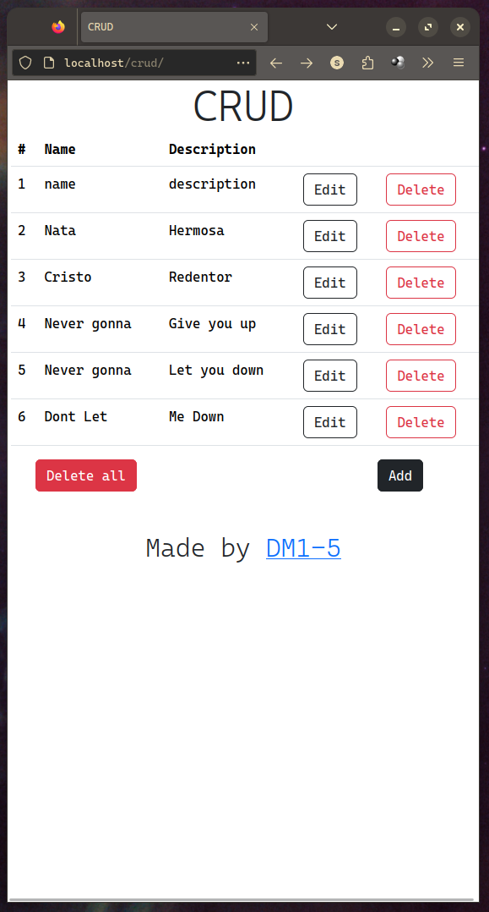

# CRUD

Crud basico con [HTML](https://developer.mozilla.org/en-US/docs/Web/HTML), [PHP](https://www.php.net/), [Bootstrap 5](https://getbootstrap.com/) y como SGBD [MariaDB](https://mariadb.org/)

